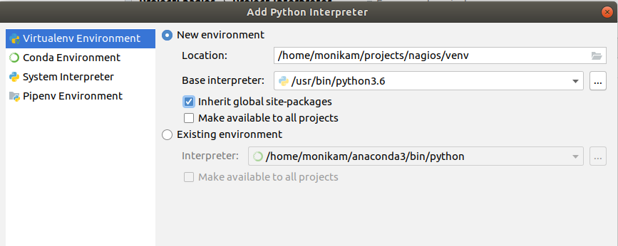

# Learn Python 

To follow these tutorials you need to install python3, related software from the python eco system, 
and an IDE, along with git on your local laptop/desktop. 

Once that is done there will be a mix of following jupyter notebook tutorials and eventually 
writing your own complete projects. 

## Install python version 3 and PyCharm IDE and git 

We'll use python version 3 and pip to install python packages. 
Since we want to install python packages so that they are available locally to your code 
but do want to avoid upgrading or changing the operating systems installed python packages we will use virtualenv. 

So here we go. You are a sysadmin so I'll keep it brief. 

Install git by following  https://git-scm.com/book/en/v2/Getting-Started-Installing-Git. 
Create an account on GitHub if you do not have one yet.

~~~
python -V 
pip -V
~~~

If its not version 3  go ahead and install using the info from https://www.python.org/downloads/
After installation you should have python3 and pip3. Now create shell aliases: 
~~~
alias python='python3'
alias pip='pip3'
~~~

IPython is the interactive python console which is useful for experimenting with code. 
This tutorial uses Jupyter notebooks for tutorials. Install the related packages: 
~~~
pip install ipython jupyter
~~~

Install virtualenv and the free community edition PyCharm, see https://www.jetbrains.com/pycharm. 
We'll use these later when you start working on your own  python projects. 
writing code. 
~~~
pip install virtualenv 
~~~

## Test Installation 

~~~
# look for version 3.*
python -V 

# rexpect info about pacakges 
pip show virtualenv 
pip show jupyter 

# you'll see lots of options 
ipython  help

git
~~~

## Start the jupyter notebook application 

Clone this project from github, https://github.com/akinom/eis_python and change into the project directory.
~~~
jupyter notebook  lesson_books 
~~~ 
The above command should open a browser window on localhost that shows a list of notebook files ending in .ipnyb. 

## PyCharm 

You'll need PyCharm when you start coding more seriously. Initially you'll be fine with notesbooks and ipython. 

The first time you start PyCharm you ned to configure a Python Interpreter. There will be a message with a link at the top right of the window, 
Click on it and make sure you add the python interpreter for version3 as the Base Interpreter. Leave the LOcation field as it is suggested. 
It is a path relative to the root of your project.

## Useful Links 

 - python - documentation - - https://docs.python.org/
 - venv - short for virualenv - https://docs.python.org/3/library/venv.html
 - pip - package installer - https://pip.pypa.io/
 - pypi - python package repsoitory - https://pypi.org/ 
 - git - cheat sheet -https://www.atlassian.com/git/tutorials/atlassian-git-cheatsheet
 

